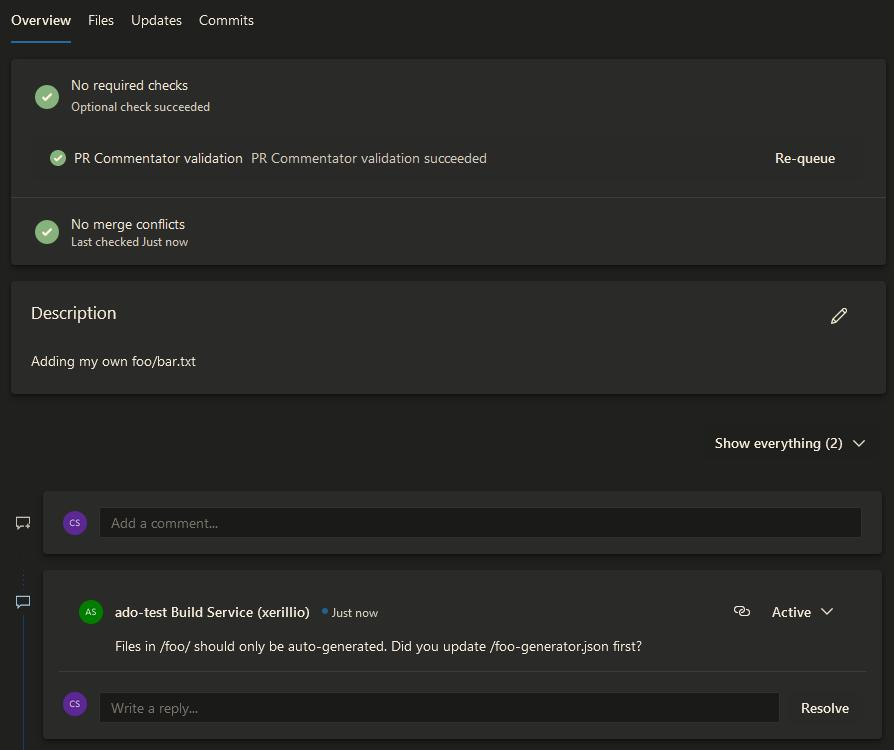

# Azure DevOps Pull Request Commentator

Improve your code review process by automating comments to avoid common mistakes or remind the developer of possible dependencies outside the pull request.

## Setting up the task

Install the extension in your collection and create a pipeline. Add the `PrCommentator` task to the YAML file and configure the inputs as you see fit:

```yml
- task: PrCommentator@1
  inputs:
   comment: 'Files in /foo/ should only be auto-generated. Did you update /foo-generator.json first?'
   fileGlob: |
     any:/foo/**/*
     none:/foo-generator.json
```

This will generate a comment like the following:



## Inputs

The task supports the following inputs:

| Input | Example | Description |
| --- | --- | --- |
| `PAT` | `PAT: 'abd123'` | A [Personal Access Token](https://learn.microsoft.com/en-us/azure/devops/organizations/accounts/use-personal-access-tokens-to-authenticate) for the identity used to create the comments. If not specified, the pipeline's build service user is used. |
| `comment` | `comment: 'The is the text inserted into the comment'` | A string with the content of the comment. [Markdown](https://learn.microsoft.com/en-us/azure/devops/project/wiki/markdown-guidance?view=azure-devops) is supported. |
| `fileGlob` | `fileGlob: 'any:/foo/**/*.js'` | One or more glob expressions, one per line. Each line may be prefixed with `any:`, `all:`  or `none:`. All lines are combined with AND logic. See details under [`fileGlob` matching modes](#fileglob-matching-modes). |
| `commitExpr` | `commitExpr: '^(fix\|feat): #\d+ .*'` | A regular expression. The pull request must have at least one commit message that **does not** match this expression for the comment to be created. NB: no [flags](https://developer.mozilla.org/en-US/docs/Web/JavaScript/Guide/Regular_Expressions#advanced_searching_with_flags) are used, which means `^`, `$` and `.` **does not** match newline characters. |

### `fileGlob` matching modes

Each line of `fileGlob` is evaluated independently and all lines must be satisfied (AND logic):

* `any:<pattern>` (default when no prefix is given) - at least one changed file must match `<pattern>`.
* `all:<pattern>` - every changed file must match `<pattern>`.
* `none:<pattern>` - no changed file may match `<pattern>`.

A leading `!` in a pattern is not special negation syntax; it's passed through as-is, so `!<pattern>` is equivalent to `any:!<pattern>`, while `all:!<pattern>` is equivalent to `none:<pattern>`, which may be more readable.

Examples:

```yml
# Plain glob (no prefix): same as "any:", matches if at least one file under /foo/ changed
fileGlob: '/foo/**/*'
```

```yml
# Negative glob: only trigger if no file under /generated/ changed
fileGlob: 'none:/generated/**/*'
```

```yml
# Mixed conditions: trigger only if a /foo/ file changed but /foo-generator.json did not
fileGlob: |
  any:/foo/**/*
  none:/foo-generator.json
```

The task uses `minimatch` for evaluating the glob expressions. See [supported glob features](https://github.com/isaacs/minimatch#features).

## Roadmap

Below is a list of coming features and future plans:

* (Input) Branch name: add a comment based on the source or target branch name
* (Input) Auto-resolve: automatically resolve or reopen a comment based on new updates to the PR
